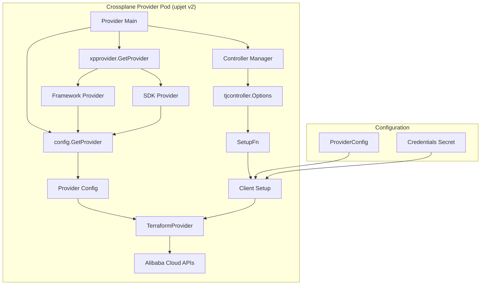

# Design Document: upjet v2 Migration

## Overview

This design document outlines the migration of the Alibaba Cloud provider from upjet v1.9.0 to upjet v2. The migration involves upgrading dependencies, refactoring the provider initialization to use embedded Terraform providers, and removing the WorkspaceStore abstraction in favor of direct provider integration.

### Current Architecture (upjet v1)

The current implementation uses upjet v1.9.0 with the following characteristics:

```go
// cmd/provider/main.go (current)
o.WorkspaceStore = terraform.NewWorkspaceStore(log, 
    terraform.WithProcessReportInterval(*pollInterval), 
    terraform.WithFeatures(o.Features))

// internal/clients/alibabacloud.go (current)
func TerraformSetupBuilder(version, providerSource, providerVersion string) terraform.SetupFn {
    return func(ctx context.Context, c client.Client, mg resource.Managed) (terraform.Setup, error) {
        ps := terraform.Setup{
            Version: version,
            Requirement: terraform.ProviderRequirement{
                Source:  providerSource,
                Version: providerVersion,
            },
        }
        // Configure credentials...
        return ps, nil
    }
}
```

This approach:
- Uses WorkspaceStore to manage Terraform operations
- Spawns Terraform CLI processes for each operation
- Requires external Terraform and provider binaries
- Uses terraform.Setup with Version and Requirement fields

### Target Architecture (upjet v2)

The upjet v2 architecture embeds the Terraform provider directly:

```go
// cmd/provider/main.go (target)
ctx := context.Background()
fwProvider, sdkProvider, err := xpprovider.GetProvider(ctx)
kingpin.FatalIfError(err, "Cannot get the Terraform framework and SDK providers")

provider, err := config.GetProvider(ctx, fwProvider, sdkProvider)
kingpin.FatalIfError(err, "Cannot initialize the provider configuration")

setupConfig := &clients.SetupConfig{
    Logger:            log,
    TerraformProvider: provider.TerraformProvider,
}

o := tjcontroller.Options{
    Options: xpcontroller.Options{
        Logger:                  log,
        GlobalRateLimiter:       ratelimiter.NewGlobal(*maxReconcileRate),
        PollInterval:            *pollInterval,
        MaxConcurrentReconciles: *maxReconcileRate,
        Features:                &feature.Flags{},
        MetricOptions: &xpcontroller.MetricOptions{
            PollStateMetricInterval: *pollStateMetricInterval,
            MRMetrics:               metricRecorder,
            MRStateMetrics:          stateMetrics,
        },
    },
    Provider:              provider,
    SetupFn:               clients.SelectTerraformSetup(setupConfig),
    PollJitter:            pollJitter,
    OperationTrackerStore: tjcontroller.NewOperationStore(log),
}
```

This approach:
- Embeds the Terraform provider in the binary
- No WorkspaceStore - uses Provider directly
- No external Terraform CLI or provider binaries needed
- Uses xpprovider package for provider initialization

## Architecture

### Component Diagram



### Execution Flow Comparison

**upjet v1 Flow:**
1. Provider starts, WorkspaceStore initializes
2. Resource reconciliation triggered
3. WorkspaceStore spawns Terraform CLI process
4. CLI process loads provider binary
5. Provider establishes connections to Alibaba Cloud APIs
6. Operation executes
7. Process terminates
8. Repeat for next resource

**upjet v2 Flow:**
1. Provider starts, xpprovider.GetProvider() initializes embedded providers
2. config.GetProvider() creates Provider with embedded TerraformProvider
3. Resource reconciliation triggered
4. SetupFn configures credentials on TerraformProvider
5. Provider executes operation (reusing embedded provider)
6. Result returned
7. Repeat for next resource (no process restart)

## Components and Interfaces

### 1. Main Provider Entry Point (`cmd/provider/main.go`)

**Current Implementation (upjet v1):**
```go
o := tjcontroller.Options{
    Options: xpcontroller.Options{
        Logger:                  log,
        GlobalRateLimiter:       ratelimiter.NewGlobal(*maxReconcileRate),
        PollInterval:            *pollInterval,
        MaxConcurrentReconciles: *maxReconcileRate,
        Features:                &feature.Flags{},
        MetricOptions: &xpcontroller.MetricOptions{
            PollStateMetricInterval: *pollStateMetricInterval,
            MRMetrics:               metricRecorder,
            MRStateMetrics:          stateMetrics,
        },
    },
    Provider: config.GetProvider(),
    SetupFn:  clients.TerraformSetupBuilder(*terraformVersion, *providerSource, *providerVersion),
}

o.WorkspaceStore = terraform.NewWorkspaceStore(log, 
    terraform.WithProcessReportInterval(*pollInterval), 
    terraform.WithFeatures(o.Features))
```

**New Implementation (upjet v2):**
```go
ctx := context.Background()
fwProvider, sdkProvider, err := xpprovider.GetProvider(ctx)
kingpin.FatalIfError(err, "Cannot get the Terraform framework and SDK providers")

provider, err := config.GetProvider(ctx, fwProvider, sdkProvider)
kingpin.FatalIfError(err, "Cannot initialize the provider configuration")

setupConfig := &clients.SetupConfig{
    Logger:            log,
    TerraformProvider: provider.TerraformProvider,
}

o := tjcontroller.Options{
    Options: xpcontroller.Options{
        Logger:                  log,
        GlobalRateLimiter:       ratelimiter.NewGlobal(*maxReconcileRate),
        PollInterval:            *pollInterval,
        MaxConcurrentReconciles: *maxReconcileRate,
        Features:                &feature.Flags{},
        MetricOptions: &xpcontroller.MetricOptions{
            PollStateMetricInterval: *pollStateMetricInterval,
            MRMetrics:               metricRecorder,
            MRStateMetrics:          stateMetrics,
        },
    },
    Provider:              provider,
    SetupFn:               clients.SelectTerraformSetup(setupConfig),
    PollJitter:            pollJitter,
    OperationTrackerStore: tjcontroller.NewOperationStore(log),
}

// Remove WorkspaceStore initialization - not needed in upjet v2
```

**Interface Changes:**
- Remove `terraformVersion`, `providerSource`, `providerVersion` flags
- Add xpprovider initialization
- Remove WorkspaceStore initialization
- Add SetupConfig with TerraformProvider

**Deprecated Flags to Remove:**
```go
// Remove these flags:
terraformVersion = app.Flag("terraform-version", "Terraform version.").Required().Envar("TERRAFORM_VERSION").String()
providerSource   = app.Flag("terraform-provider-source", "Terraform provider source.").Required().Envar("TERRAFORM_PROVIDER_SOURCE").String()
providerVersion  = app.Flag("terraform-provider-version", "Terraform provider version.").Required().Envar("TERRAFORM_PROVIDER_VERSION").String()
```

### 2. Provider Configuration (`config/provider.go`)

**Current Implementation (upjet v1):**
```go
func GetProvider() *ujconfig.Provider {
    defaultResourceOptions := []ujconfig.ResourceOption{
        ExternalNameConfigurations(),
        RegionAddition(),
        IdentifierAssignedByAlibabaCloud(),
        KnownReferences(),
        NamePrefixRemoval(),
        AddExternalTagsField(),
        DocumentationForTags(),
    }

    pc := ujconfig.NewProvider([]byte(providerSchema), resourcePrefix, modulePath, []byte(providerMetadata),
        ujconfig.WithShortName("alibabacloud"),
        ujconfig.WithRootGroup("alibabacloud.crossplane.io"),
        ujconfig.WithIncludeList(ExternalNameConfigured()),
        ujconfig.WithReferenceInjectors([]ujconfig.ReferenceInjector{reference.NewInjector(modulePath)}),
        ujconfig.WithFeaturesPackage("internal/features"),
        ujconfig.WithDefaultResourceOptions(defaultResourceOptions...))

    // Configure resources...
    pc.ConfigureResources()
    return pc
}
```

**New Implementation (upjet v2):**
```go
func GetProvider(ctx context.Context, fwProvider fwprovider.Provider, sdkProvider *schema.Provider) (*config.Provider, error) {
    defaultResourceOptions := []ujconfig.ResourceOption{
        ExternalNameConfigurations(),
        RegionAddition(),
        IdentifierAssignedByAlibabaCloud(),
        KnownReferences(),
        NamePrefixRemoval(),
        AddExternalTagsField(),
        DocumentationForTags(),
    }

    pc := ujconfig.NewProvider([]byte(providerSchema), resourcePrefix, modulePath, []byte(providerMetadata),
        ujconfig.WithShortName("alibabacloud"),
        ujconfig.WithRootGroup("alibabacloud.crossplane.io"),
        ujconfig.WithIncludeList(ExternalNameConfigured()),
        ujconfig.WithReferenceInjectors([]ujconfig.ReferenceInjector{reference.NewInjector(modulePath)}),
        ujconfig.WithFeaturesPackage("internal/features"),
        ujconfig.WithTerraformProvider(sdkProvider),
        ujconfig.WithTerraformPluginFrameworkProvider(fwProvider),
        ujconfig.WithDefaultResourceOptions(defaultResourceOptions...))

    // Configure resources...
    pc.ConfigureResources()
    return pc, nil
}
```

**Key Changes:**
- Add `ctx`, `fwProvider`, `sdkProvider` parameters
- Add `WithTerraformProvider(sdkProvider)` option
- Add `WithTerraformPluginFrameworkProvider(fwProvider)` option
- Return error for consistency with upjet v2 patterns

### 3. Client Setup (`internal/clients/alibabacloud.go`)

**Current Implementation (upjet v1):**
```go
func TerraformSetupBuilder(version, providerSource, providerVersion string) terraform.SetupFn {
    return func(ctx context.Context, c client.Client, mg resource.Managed) (terraform.Setup, error) {
        ps := terraform.Setup{
            Version: version,
            Requirement: terraform.ProviderRequirement{
                Source:  providerSource,
                Version: providerVersion,
            },
        }
        
        // Extract credentials...
        creds, err := extractAndUnmarshalCredentials(ctx, c, configRef)
        if err != nil {
            return ps, errors.Wrap(err, errUnmarshalCredentials)
        }

        region, err := getRegion(mg, creds)
        if err != nil {
            return ps, errors.Wrap(err, "cannot get region")
        }

        // Set credentials in Terraform provider configuration
        ps.Configuration = map[string]any{
            "region": region,
        }
        if v, ok := creds["access_key"]; ok {
            ps.Configuration["access_key"] = v
        }
        if v, ok := creds["secret_key"]; ok {
            ps.Configuration["secret_key"] = v
        }
        if v, ok := creds["security_token"]; ok {
            ps.Configuration["security_token"] = v
        }
        ps.Configuration["configuration_source"] = getUserAgent()
        return ps, nil
    }
}
```

**New Implementation (upjet v2):**
```go
type SetupConfig struct {
    TerraformProvider *schema.Provider
    Logger            logging.Logger
}

func SelectTerraformSetup(config *SetupConfig) terraform.SetupFn {
    return func(ctx context.Context, c client.Client, mg resource.Managed) (terraform.Setup, error) {
        ps := terraform.Setup{}
        
        configRef := mg.GetProviderConfigReference()
        if configRef == nil {
            return ps, errors.New(errNoProviderConfig)
        }

        t := resource.NewProviderConfigUsageTracker(c, &v1beta1.ProviderConfigUsage{})
        if err := t.Track(ctx, mg); err != nil {
            return ps, errors.Wrap(err, errTrackUsage)
        }

        // Extract credentials (existing logic)
        creds, err := extractAndUnmarshalCredentials(ctx, c, configRef)
        if err != nil {
            return ps, errors.Wrap(err, errUnmarshalCredentials)
        }

        // Get region (existing logic)
        region, err := getRegion(mg, creds)
        if err != nil {
            return ps, errors.Wrap(err, "cannot get region")
        }

        // Configure the embedded provider
        if config.TerraformProvider == nil {
            return ps, errors.New("terraform provider cannot be nil")
        }

        return ps, errors.Wrap(configureNoForkAlibabaCloudClient(ctx, &ps, config, region, creds), 
            "could not configure the no-fork Alibaba Cloud client")
    }
}

func configureNoForkAlibabaCloudClient(ctx context.Context, ps *terraform.Setup, config *SetupConfig, region string, creds map[string]string) error {
    // Configure provider with credentials
    tfConfig := xpprovider.AlibabaCloudConfig{
        AccessKey:    creds["access_key"],
        SecretKey:    creds["secret_key"],
        SecurityToken: creds["security_token"],
        Region:       region,
        ConfigurationSource: getUserAgent(),
    }

    // Get the provider client/meta
    tfClient, diags := tfConfig.GetClient(ctx, config.TerraformProvider)
    if diags.HasError() {
        return errors.Errorf("cannot construct TF Alibaba Cloud Client from TF Config, %v", diags)
    }

    ps.Meta = tfClient
    // Note: FrameworkProvider may not be needed if alicloud only uses SDK
    // ps.FrameworkProvider = xpprovider.GetFrameworkProviderWithMeta(tfClient)

    return nil
}
```

**Key Changes:**
- Remove `version`, `providerSource`, `providerVersion` parameters
- Add `SetupConfig` struct with `TerraformProvider` and `Logger`
- Remove `ps.Version` and `ps.Requirement` (not used in upjet v2)
- Add `configureNoForkAlibabaCloudClient` function
- Preserve existing credential extraction and region resolution logic
- Preserve user agent configuration

**Preserved Logic:**
- `extractAndUnmarshalCredentials()` - unchanged
- `getRegion()` - unchanged
- `getUserAgent()` - unchanged

### 4. xpprovider Package (New)

This package needs to be created to provide the embedded Terraform provider. This will be similar to AWS provider's xpprovider package.

**Location:** `github.com/aliyun/terraform-provider-alicloud/xpprovider`

**Key Functions:**
```go
package xpprovider

import (
    "context"
    "github.com/hashicorp/terraform-plugin-framework/provider"
    "github.com/hashicorp/terraform-plugin-sdk/v2/helper/schema"
)

// GetProvider returns the framework and SDK providers
func GetProvider(ctx context.Context) (provider.Provider, *schema.Provider, error) {
    // Initialize the Alibaba Cloud provider
    sdkProvider := Provider() // This is the existing provider function
    
    // Framework provider may be nil if not used
    var fwProvider provider.Provider = nil
    
    return fwProvider, sdkProvider, nil
}

// AlibabaCloudConfig holds provider configuration
type AlibabaCloudConfig struct {
    AccessKey           string
    SecretKey           string
    SecurityToken       string
    Region              string
    ConfigurationSource string
}

// GetClient configures and returns the provider client
func (c *AlibabaCloudConfig) GetClient(ctx context.Context, p *schema.Provider) (interface{}, diag.Diagnostics) {
    // Configure the provider with credentials
    config := map[string]interface{}{
        "access_key":           c.AccessKey,
        "secret_key":           c.SecretKey,
        "security_token":       c.SecurityToken,
        "region":               c.Region,
        "configuration_source": c.ConfigurationSource,
    }
    
    diags := p.Configure(ctx, terraform.NewResourceConfigRaw(config))
    if diags.HasError() {
        return nil, diags
    }
    
    return p.Meta(), diags
}
```

**Note:** This package may need to be contributed to the terraform-provider-alicloud repository, or created as a wrapper in this provider repository.

## State Storage

### How Terraform State is Stored

**Important:** Both upjet v1 and upjet v2 store Terraform state in the **Kubernetes resource's status.atProvider field**, NOT in external Terraform state files.

#### State Storage Architecture

```go
// Example: VPC resource
type VPC struct {
    metav1.TypeMeta   `json:",inline"`
    metav1.ObjectMeta `json:"metadata,omitempty"`
    
    Spec   VPCSpec   `json:"spec"`
    Status VPCStatus `json:"status,omitempty"`  // State stored here
}

type VPCStatus struct {
    xpv1.ResourceStatus `json:",inline"`
    AtProvider          VPCObservation `json:"atProvider,omitempty"`  // Terraform state
}

type VPCObservation struct {
    ID          *string `json:"id,omitempty" tf:"id,omitempty"`
    CidrBlock   *string `json:"cidrBlock,omitempty" tf:"cidr_block,omitempty"`
    Status      *string `json:"status,omitempty" tf:"status,omitempty"`
    // ... all observed fields from Terraform
}
```

#### How State is Managed

**GetObservation (Read State):**
```go
func (tr *VPC) GetObservation() (map[string]any, error) {
    // Marshals status.atProvider to map for Terraform operations
    o, err := json.TFParser.Marshal(tr.Status.AtProvider)
    if err != nil {
        return nil, err
    }
    return o, json.TFParser.Unmarshal(o, &map[string]any{})
}
```

**SetObservation (Write State):**
```go
func (tr *VPC) SetObservation(obs map[string]any) error {
    // Unmarshals Terraform state into status.atProvider
    p, err := json.TFParser.Marshal(obs)
    if err != nil {
        return err
    }
    return json.TFParser.Unmarshal(p, &tr.Status.AtProvider)
}
```

#### State Flow in upjet v1 vs v2

**upjet v1 (WorkspaceStore):**
1. Controller calls Terraform operation via WorkspaceStore
2. WorkspaceStore spawns Terraform CLI process
3. Terraform CLI reads state from status.atProvider (via GetObservation)
4. Terraform CLI executes operation against cloud provider
5. Terraform CLI returns new state
6. WorkspaceStore writes state to status.atProvider (via SetObservation)
7. Kubernetes API server persists the resource with updated status

**upjet v2 (Embedded Provider):**
1. Controller calls Terraform operation via embedded provider
2. Embedded provider reads state from status.atProvider (via GetObservation)
3. Embedded provider executes operation against cloud provider
4. Embedded provider returns new state
5. Controller writes state to status.atProvider (via SetObservation)
6. Kubernetes API server persists the resource with updated status

**Key Difference:** The state storage location (status.atProvider) is **identical** in both architectures. The only difference is HOW the Terraform provider is invoked (external process vs embedded).

#### Benefits of Kubernetes-Native State Storage

1. **No External State Backend:** No need for S3, Consul, or other Terraform backends
2. **RBAC Integration:** State access controlled by Kubernetes RBAC
3. **Backup/Restore:** State backed up with Kubernetes resources
4. **Audit Trail:** State changes tracked in Kubernetes audit logs
5. **Multi-Tenancy:** State isolated per namespace
6. **High Availability:** State replicated by etcd

#### State Migration Considerations

**Important:** Since both upjet v1 and v2 use the same state storage mechanism (status.atProvider), **no state migration is required** when upgrading from v1 to v2. Existing resources will continue to work with their existing state.

## Data Models

### Configuration Data Model

**upjet v1:**
```go
type Setup struct {
    Version     string
    Requirement ProviderRequirement
    Configuration map[string]any
}

type ProviderRequirement struct {
    Source  string
    Version string
}
```

**upjet v2:**
```go
type Setup struct {
    Meta              interface{}           // Provider SDK client
    FrameworkProvider fwprovider.Provider   // Framework provider (optional)
    Configuration     map[string]any        // Still used for external name templating
    ClientMetadata    map[string]string     // Additional metadata
}
```

### SetupConfig Model

```go
type SetupConfig struct {
    TerraformProvider *schema.Provider
    Logger            logging.Logger
}
```

## Error Handling

### Error Scenarios and Handling

#### 1. Provider Initialization Failure

**Scenario:** xpprovider.GetProvider() fails

**Detection:**
```go
fwProvider, sdkProvider, err := xpprovider.GetProvider(ctx)
if err != nil {
    kingpin.FatalIfError(err, "Cannot get the Terraform framework and SDK providers")
}
```

**Recovery:** Fail fast at startup with descriptive error message

#### 2. Provider Configuration Failure

**Scenario:** config.GetProvider() fails

**Detection:**
```go
provider, err := config.GetProvider(ctx, fwProvider, sdkProvider)
if err != nil {
    kingpin.FatalIfError(err, "Cannot initialize the provider configuration")
}
```

**Recovery:** Fail fast at startup

#### 3. Credential Configuration Failure

**Scenario:** Credentials cannot be extracted or are invalid

**Detection:** Existing error handling in `extractAndUnmarshalCredentials`

**Handling:**
```go
creds, err := extractAndUnmarshalCredentials(ctx, c, configRef)
if err != nil {
    return ps, errors.Wrap(err, errUnmarshalCredentials)
}
```

**Recovery:** Return error, controller will retry based on reconciliation policy

#### 4. Client Configuration Failure

**Scenario:** configureNoForkAlibabaCloudClient fails

**Detection:**
```go
if err := configureNoForkAlibabaCloudClient(ctx, &ps, config, region, creds); err != nil {
    return ps, errors.Wrap(err, "could not configure the no-fork Alibaba Cloud client")
}
```

**Recovery:** Return error, controller will retry

### Error Logging Standards

All errors should include:
- Error message
- Context about what operation failed
- Relevant configuration details (without sensitive data)

Example:
```go
config.Logger.Info("Configuring Alibaba Cloud provider",
    "region", region,
    "has_access_key", creds["access_key"] != "",
    "has_secret_key", creds["secret_key"] != "")
```

## Testing Strategy

### End-to-End Testing

The project uses the uptest framework for e2e testing. Tests should verify:

#### 1. Provider Initialization Tests

**Test:** Verify provider starts successfully with upjet v2
```bash
make local-deploy
kubectl wait provider.pkg provider-upjet-alibabacloud --for condition=Healthy --timeout 5m
```

#### 2. Resource Lifecycle Tests

**Test:** Verify CRUD operations work with upjet v2
```bash
export UPTEST_CLOUD_CREDENTIALS='{
    "access_key": "...",
    "secret_key": "...",
    "region": "cn-hangzhou"
}'

make uptest UPTEST_EXAMPLE_LIST=examples/vpc/v1alpha1/vpc.yaml
```

**Verify:**
- Resource creation succeeds
- Resource updates work correctly
- Resource deletion completes
- Status conditions are set correctly

#### 3. Credential Configuration Tests

**Test:** Verify different credential configurations work
- Access key + secret key
- Access key + secret key + security token
- Region from credentials
- Region from spec.forProvider.region

#### 4. Existing Examples Tests

**Test:** Run all existing example manifests
```bash
make uptest UPTEST_EXAMPLE_LIST=$(UPTEST_EXAMPLE_LIST_VPC)
make uptest UPTEST_EXAMPLE_LIST=$(UPTEST_EXAMPLE_LIST_ECS)
# ... etc for all resource groups
```

### Performance Testing

#### 1. Memory Footprint Comparison

**Test:** Compare memory usage between upjet v1 and v2
```
Scenario: Reconcile 50 VPC resources
Measure: Peak memory usage
Expected: upjet v2 uses 30-50% less memory
```

#### 2. Reconciliation Latency Comparison

**Test:** Compare operation latency
```
Scenario: Create 50 VPC resources sequentially
Measure: Average time per operation
Expected: upjet v2 is 20-40% faster
```

### Compatibility Testing

#### 1. Backward Compatibility

**Test:** Existing resources continue to work
```
Setup: Resources created with upjet v1
Action: Upgrade to upjet v2
Verify: Resources continue to reconcile correctly
```

#### 2. ProviderConfig Compatibility

**Test:** Existing ProviderConfig resources work
```
Setup: ProviderConfig with credentials secret
Action: Deploy upjet v2 provider
Verify: Provider can read and use credentials
```

### Test Environment Setup

**Prerequisites:**
- Kubernetes cluster (kind or real cluster)
- Alibaba Cloud credentials
- Provider image with upjet v2

**Test Execution:**
```bash
# Build provider with upjet v2
make submodules
make generate
make build

# Run e2e tests
export UPTEST_CLOUD_CREDENTIALS='{
    "access_key": "...",
    "secret_key": "...",
    "region": "cn-hangzhou"
}'

make e2e
```

## Migration Path

### Phase 1: Dependency Upgrade

1. Update go.mod:
   - Upgrade upjet from v1.9.0 to v2.x
   - Upgrade crossplane-runtime to v2.x
   - Add terraform-provider-alicloud as direct dependency

2. Update imports:
   - Update all upjet imports to v2 paths
   - Update crossplane-runtime imports to v2 paths

3. Resolve breaking changes:
   - Fix API changes in upjet v2
   - Fix API changes in crossplane-runtime v2

### Phase 2: Provider Initialization Refactoring

1. Create xpprovider package (or use existing from terraform-provider-alicloud)

2. Update cmd/provider/main.go:
   - Add xpprovider.GetProvider() call
   - Update config.GetProvider() signature
   - Remove WorkspaceStore initialization
   - Remove deprecated flags

3. Update config/provider.go:
   - Add GetProvider() parameters
   - Add WithTerraformProvider() option
   - Add WithTerraformPluginFrameworkProvider() option

### Phase 3: Client Setup Refactoring

1. Update internal/clients/alibabacloud.go:
   - Create SetupConfig struct
   - Refactor TerraformSetupBuilder to SelectTerraformSetup
   - Create configureNoForkAlibabaCloudClient function
   - Preserve existing credential and region logic

2. Test credential configuration:
   - Verify access key + secret key works
   - Verify security token works
   - Verify region resolution works

### Phase 4: Build System Updates

1. Update Makefile:
   - Remove TERRAFORM_NATIVE_PROVIDER_BINARY
   - Remove TERRAFORM_PROVIDER_DOWNLOAD_NAME
   - Remove TERRAFORM_PROVIDER_DOWNLOAD_URL_PREFIX
   - Keep TERRAFORM_PROVIDER_VERSION for schema generation

2. Update Dockerfile:
   - Remove provider binary download steps
   - Ensure go.mod includes terraform-provider-alicloud

### Phase 5: Testing and Validation

1. Run e2e tests:
   - Test all resource groups
   - Verify CRUD operations
   - Verify credential configurations

2. Performance testing:
   - Measure memory usage
   - Measure reconciliation latency
   - Compare with upjet v1 baseline

3. Compatibility testing:
   - Test with existing ProviderConfig
   - Test with existing managed resources
   - Verify backward compatibility

### Phase 6: Documentation

1. Update README.md:
   - Remove references to Terraform CLI requirements
   - Update build instructions
   - Update test instructions

2. Create migration guide:
   - Document breaking changes
   - Document new requirements
   - Document troubleshooting steps

## Correctness Properties

*A property is a characteristic or behavior that should hold true across all valid executions of a system—essentially, a formal statement about what the system should do. Properties serve as the bridge between human-readable specifications and machine-verifiable correctness guarantees.*

### Property 1: Provider Initialization

*For any* valid Alibaba Cloud provider configuration, when the provider initializes with upjet v2, it should successfully create embedded Framework and SDK provider instances.

**Validates: Requirements 1.1, 1.2, 2.1, 2.2**

### Property 2: Credential Configuration

*For any* valid credential configuration (access_key, secret_key, optional security_token, region), the SetupFn should successfully configure the embedded provider and return a valid terraform.Setup.

**Validates: Requirements 4.2, 4.4, 8.2**

### Property 3: API Compatibility

*For any* resource operation (create, read, update, delete) and any credential configuration method, the upjet v2 implementation should produce the same results as the upjet v1 implementation.

**Validates: Requirements 8.1, 8.2, 8.3, 8.4**

### Property 4: Resource Efficiency

*For any* sequence of resource operations, the upjet v2 implementation should reuse the same embedded provider instance rather than spawning new processes.

**Validates: Requirements 10.1, 10.2**

### Examples and Edge Cases

The following specific scenarios should be tested as examples or edge cases:

**Example 1: Provider Initialization**
- Verify that xpprovider.GetProvider() returns valid Framework and SDK providers
- **Validates: Requirements 2.1, 2.2**

**Example 2: Provider Configuration**
- Verify that config.GetProvider() accepts Framework and SDK providers and returns configured Provider
- **Validates: Requirements 3.1, 3.2, 3.3**

**Example 3: Credential Configuration**
- Verify that SetupFn configures credentials correctly on the embedded provider
- **Validates: Requirements 4.1, 4.2**

**Example 4: Region Resolution**
- Verify that region is resolved from spec.forProvider.region or credentials
- **Validates: Requirements 4.4**

**Example 5: User Agent**
- Verify that user agent is set correctly with version information
- **Validates: Requirements 4.5**

**Edge Case 1: Missing Credentials**
- When credentials are missing, verify descriptive error is returned
- **Validates: Requirements 9.1, 9.2**

**Edge Case 2: Invalid Region**
- When region is invalid, verify appropriate error is returned
- **Validates: Requirements 9.2**

**Edge Case 3: Provider Initialization Failure**
- When xpprovider.GetProvider() fails, verify provider fails fast with clear error
- **Validates: Requirements 9.1**

**Edge Case 4: Nil TerraformProvider**
- When SetupConfig.TerraformProvider is nil, verify descriptive error is returned
- **Validates: Requirements 9.3**
